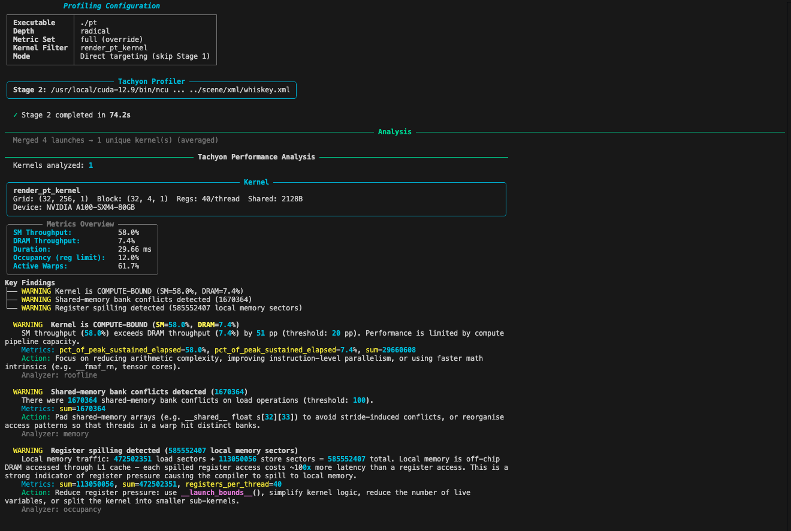
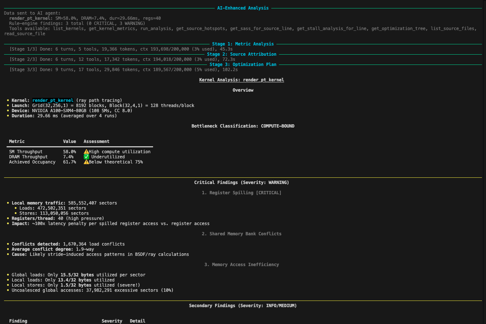
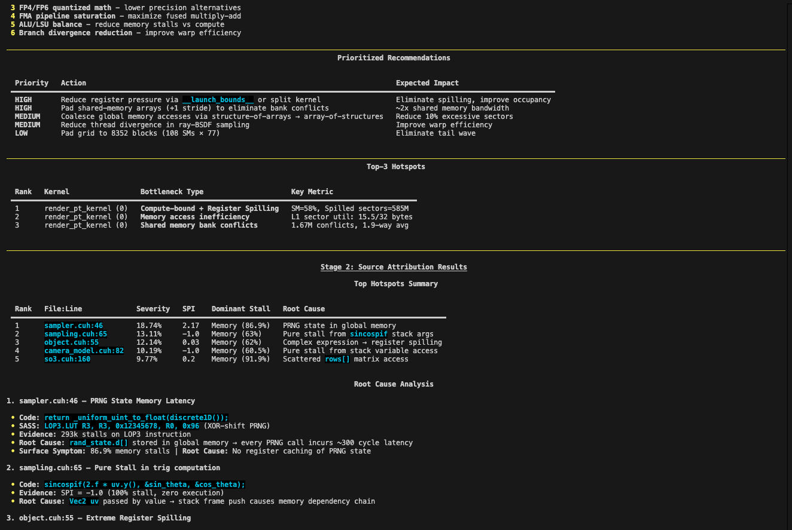
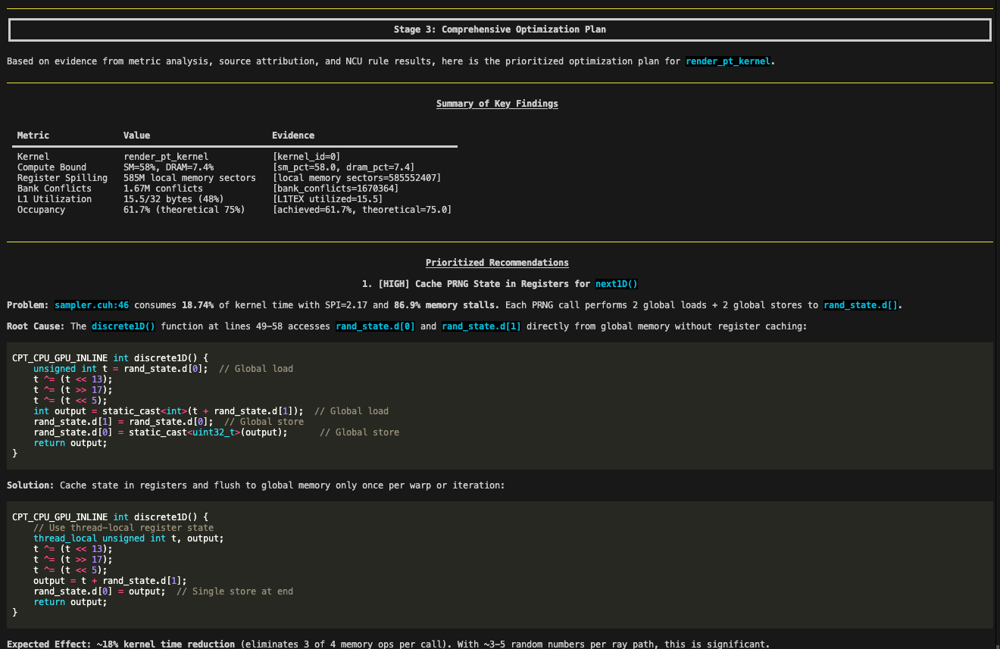
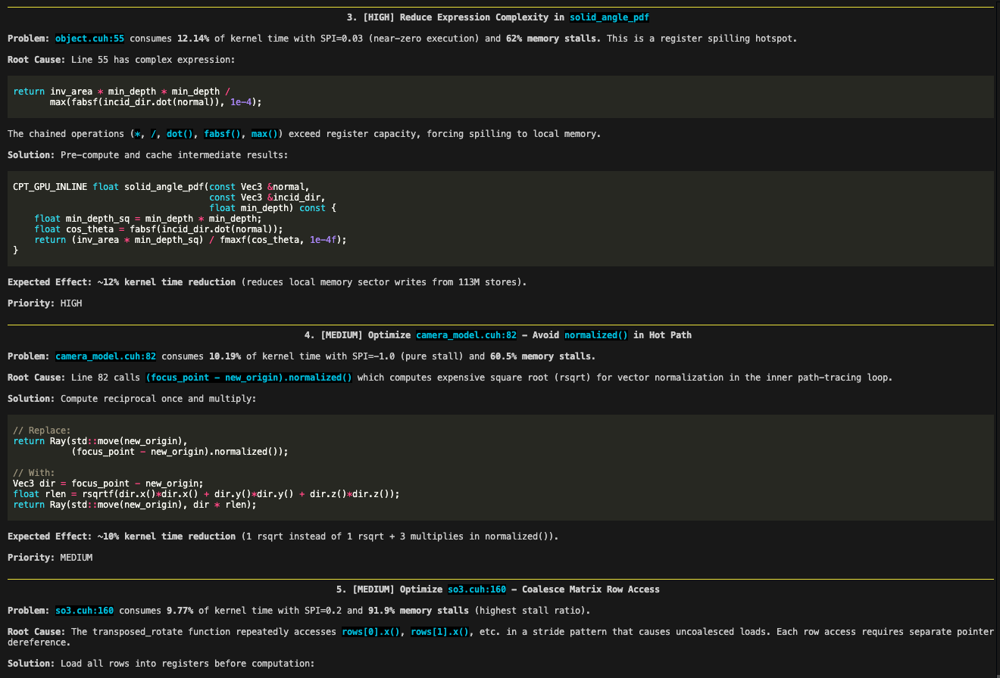
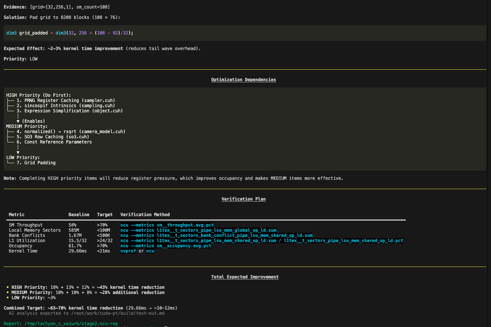

# CLI Output Preview

Using tachyon to profile [`cuda-pt` (my CUDA path tracing renderer)](https://github.com/Enigmatisms/cuda-pt), the following is generated using `tachyon profile` (end2end) mode with `--radical` setting (3 stages analysis), and the Agent API service is provided by MINIMAX-M2.5. The following are some partial screenshots.

The profiler starts with a rule-based analyzer and optimization tree:

`--radical` mode has 3 stages (metrics analysis, source code and SASS level analysis, code-based optimization suggestion).

Preview of some of the output of the stage 2 and 3:

`--lang zh` is available for printing in Chinese.

There will be more preview output for `tachyon chat` and `tachyon evolve` modes in the future.
