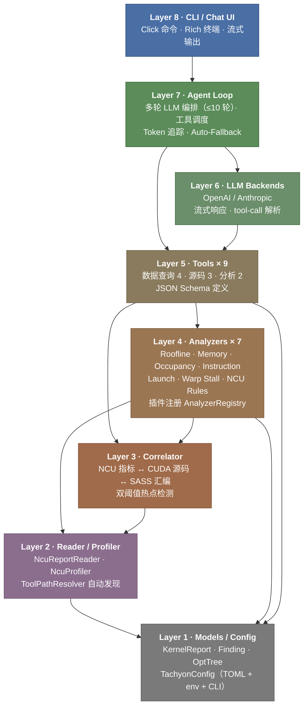
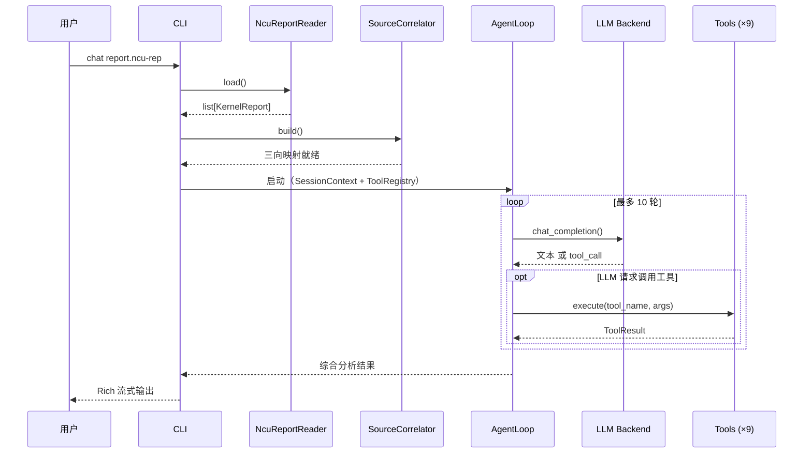
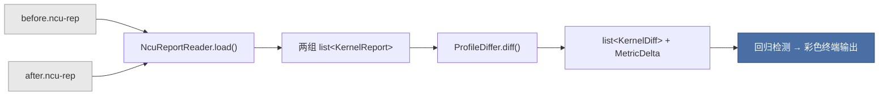

# Tachyon 架构

Tachyon 采用八层栈式架构，每一层只依赖它下面的层，上层对下层没有反向依赖。这种设计让各层可以独立测试、独立演进，也方便按阶段交付功能。

---

## 项目目录

```
src/tachyon/
├── cli/            # 命令行入口（chat / profile / diff / evolve / serve）
├── agent/          # Agent 循环、系统提示词、上下文压缩
├── llm/            # LLM 后端适配（OpenAI / Anthropic）
├── tools/          # 9 个 Agent 可调用工具 + ToolRegistry
├── server/         # MCP stdio 服务
├── analyzers/      # 7 个规则分析器 + 插件式注册
├── correlator/     # 三向映射引擎（指标 ↔ 源码 ↔ SASS）
├── reader/         # NCU 报告解析（.ncu-rep → KernelReport）
├── profiler/       # 两阶段智能 Profiling + 工具路径自动发现
├── models/         # 核心数据模型（KernelReport / Finding / OptTree 等）
├── config/         # 分层配置（TOML → 环境变量 → CLI 参数）
├── report/         # 输出渲染（Rich 终端 / Markdown）
├── diff/           # 两次 profile 对比 + 回归检测
├── tree/           # 五分支优化树
├── errors/         # ToolResult 封装 + ErrorCode
└── i18n/           # 语言
```

---

## 分层架构



---

## 各模块职责

**Layer 8 — 用户接口**

- `cli/` — 四个 Click 命令：`chat`、`profile`、`diff`、`serve`（加上 `evolve` 子命令）
- `server/` — MCP stdio 服务端，把 9 个工具暴露为 MCP Tool，处理调用分发

**Layer 7 — Agent 编排**

- `agent/` — 多轮对话循环，最多 10 轮，管理会话历史，调度工具调用，末轮强制综合输出
- `agent/persona.py` — 从 `persona.md` 模板构造系统提示词，注入工具目录和 kernel 上下文
- `agent/context.py` — 上下文窗口管理，token 超预算时自动压缩历史

**Layer 6 — LLM 后端**

- `llm/` — 抽象基类 `LLMBackend`（`chat_completion()` + 流式），OpenAI / Anthropic 两种实现，工厂函数 `create_backend(config)` 按配置创建

**Layer 5 — 工具层**

- `tools/registry.py` — `ToolDefinition`（名称、描述、JSON Schema、handler）和 `ToolRegistry`（注册 / 查找 / 执行），支持导出 OpenAI、Anthropic、MCP 三种格式
- `tools/data_query.py` — 4 个数据查询工具：`list_kernels`、`get_kernel_metrics`、`get_kernel_summary`、`get_ncu_rule_results`
- `tools/source.py` — 3 个源码工具：`get_source_hotspots`、`get_sass_for_source_line`、`get_stall_analysis_for_line`
- `tools/analysis.py` — 2 个分析工具：`run_analysis`、`get_optimization_tree`
- `tools/context.py` — `SessionContext`，持有已加载的 kernel、correlator、analyzer registry

**Layer 4 — 分析引擎**

- `analyzers/` — 抽象基类 `Analyzer` + 7 个具体分析器，`AnalyzerRegistry` 自动发现子类，可选注入 `SourceCorrelator` 做源码级归因
- `report/` — 输出渲染：`TerminalReporter`（Rich）和 `MarkdownReporter`
- `diff/` — `ProfileDiffer`，按名称匹配 kernel，计算逐指标 delta，检测回归
- `tree/` — `OptimizationTree`，从 Finding 构建五分支优化树，按检测到的瓶颈裁剪

**Layer 3 — 关联映射**

- `correlator/` — `SourceCorrelator`，把 PC 地址映射到源码行和 SASS 指令，按源码行聚合 stall 和执行指标，产出 `SourceHotspot`

**Layer 2 — 数据采集**

- `reader/` — `NcuReportReader`，封装 NVIDIA `ncu_report.py`，把 `.ncu-rep` 解析为 `KernelReport`，自动发现 NCU Python 包
- `profiler/` — `NcuProfiler` 两阶段采集（快扫全量 → 深钻 Top-K），`ToolPathResolver` 自动发现 `ncu` / `nvdisasm` / `cuobjdump`，`pipeline.py` 端到端编排

**Layer 1 — 基础设施**

- `models/` — 核心类型：`KernelReport`、`LaunchParams`、`DeviceInfo`、`MetricValue`、`Finding`、`Severity`、`SourceLocation`、`OptimizationNode`、`SourceHotspot`
- `config/` — `TachyonConfig` 四段配置（`llm` / `profiling` / `output` / `tools`），加载优先级：默认值 → TOML → 环境变量 → CLI 参数
- `errors/` — `ToolResult`（成功/失败信封）、`ErrorCode` 枚举
- `i18n/` — 输出字符串国际化

---

## 数据流

### 规则分析（profile --no-ai 模式）


### AI 对话（chat 命令）



### 端到端采集（profile 命令）


### 两次对比（diff 命令）



---

## 关键设计决策

**1. 工具路径不硬编码**

NVIDIA 工具在不同机器上的安装位置千差万别。`ToolPathResolver` 按优先级搜索：配置文件 → PATH → `$CUDA_HOME` → 常见安装目录 → glob 模式，找到后缓存到会话结束。

**2. 分析器插件化**

每个分析器是一个独立的 `Analyzer` 子类。`AnalyzerRegistry.auto_register()` 自动发现所有子类并注册，加一条新规则只需写一个新类，不用改注册代码。

**3. LLM 后端可替换**

`LLMBackend` 抽象基类隔离了所有供应商相关的逻辑。从 OpenAI 切到 Anthropic 只需要改配置，代码一行不动。

**4. 工具定义多格式导出**

每个 `ToolDefinition` 可以序列化为 OpenAI function-calling、Anthropic tool-use、MCP Tool 三种格式（`to_openai()` / `to_anthropic()` / `to_mcp()`），一套定义服务所有场景。

**5. 无 API Key 自动降级**

没有配置 LLM API Key 时，`chat` 命令自动退化为 Rule-Only 模式——只跑分析器，不走 Agent 循环，确保核心分析功能始终可用。

**6. ToolResult 统一封装**

所有操作返回带类型的 `ToolResult`（成功/失败），从 Reader 到 CLI 全链路统一错误传播，不会出现裸异常在中间层丢失。
