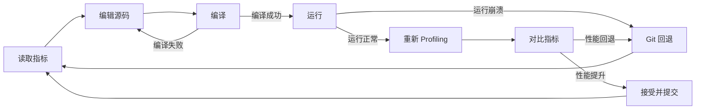
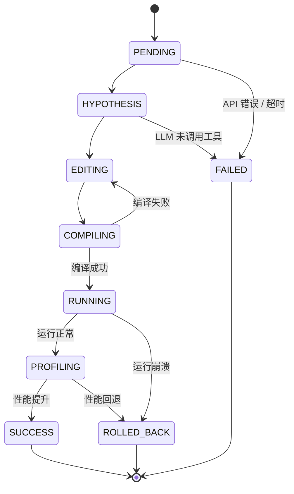

# Evolve [WIP]: 自动迭代优化 CUDA Kernel

本部分核心功能已存在，实测可用，但是目前的成功率让我个人并不感到很爽。不确定是模型层问题还是 tool chain 层问题。

Evolve 是 tachyon 的一个子命令，用于自动优化 CUDA kernel 性能。它反复执行「profiling → 分析瓶颈 → 编辑源码 → 编译 → 验证 → 重新 profiling」的循环，每一轮根据结果决定接受或回退。整个过程无需人工干预。

## 工作流程

每一轮迭代遵循相同的生命周期：



1. **读取**: Agent 读取 kernel 的 NCU 指标和源码
2. **编辑**: 根据瓶颈分析修改 CUDA 源文件；编译失败时 Agent 可以再次编辑
3. **编译**: 执行构建命令
4. **运行**: 执行二进制验证正确性（非零退出码 → 自动回退）
5. **重新 Profiling**: 用 NCU 重新采集修改后的 kernel 指标
6. **对比**: 比较基线与当前指标；GPU 耗时降低则接受改动并 git commit

如果运行崩溃或指标回退，改动自动回退到上一个已接受的状态。

## 快速开始

### 基本用法

最简单的方式：指定二进制文件和构建命令。

```bash
tachyon evolve ./my_cuda_app --build "make -j8" -- ./my_cuda_app arg1 arg2
```

`--` 之后的参数传给可执行文件，不传给 tachyon。

### 使用已有 NCU 报告

如果已经有基线 `.ncu-rep`，跳过初始 profiling 节省时间：

```bash
tachyon evolve --report baseline.ncu-rep ./my_cuda_app --build "make -j8"
```

### 指定目标 Kernel

二进制包含多个 kernel 时，聚焦其中一个：

```bash
tachyon evolve -k my_reduction_kernel ./my_cuda_app --build "make -j8"
```

### 交互模式

在迭代之间暂停，方便检查或引导 Agent：

```bash
tachyon evolve -i ./my_cuda_app --build "make -j8"
```

### 配置文件

重复运行时，把构建/运行配置写到项目根目录的 `.tachyon/evolve.toml`：

```toml
build_cmd = "make -j8"
run_cmd = "./build/my_app --size 4096"
target_kernel = "reduce_kernel"
max_iterations = 15

[build]
timeout = 300

[run]
timeout = 120

[git]
auto_commit = true
auto_rollback = true

allowed_edit_paths = ["src/kernels/"]
```

然后直接运行：

```bash
tachyon evolve ./my_cuda_app
```

CLI 参数优先级高于配置文件。

## CLI 参数

```
tachyon evolve [OPTIONS] EXECUTABLE [EXE_ARGS]...
```

| 参数 | 默认值 | 说明 |
|------|--------|------|
| `--report` | — | 加载已有 `.ncu-rep` 作为基线，跳过初始 profiling |
| `--build` | — | 构建命令，如 `"make -j8"` 或 `"cmake --build build"` |
| `--run` | — | 运行/测试命令（默认直接执行二进制） |
| `--config` | — | `evolve.toml` 配置文件路径 |
| `--max-iterations` | 10 | 最大迭代次数 |
| `--kernel`, `-k` | — | 目标 kernel 名称过滤（子串匹配） |
| `--model`, `-m` | — | LLM 模型名称 |
| `--provider`, `-p` | — | LLM 后端（openai, anthropic） |
| `--interactive`, `-i` | 关 | 迭代间暂停，等待用户确认 |
| `--verbose`, `-v` | 关 | 显示工具调用和调试信息 |
| `--quiet`, `-q` | 关 | 只显示最终汇总 |
| `--export` | — | 导出结果到 markdown 文件 |
| `--lang` | 自动 | 输出语言（en / zh） |
| `--ncu-set` | full | NCU 采集级别：basic, detailed, full |
| `--ncu-metrics` | — | 自定义 NCU 指标，逗号分隔 |
| `--ncu-args` | — | 传递给 ncu 的额外参数 |
| `--timeout` | 3600 | 总超时时间（秒） |

## Agent 工具与优化策略

LLM Agent 在每轮迭代中可使用以下工具：

| 工具 | 用途 |
|------|------|
| `get_kernel_summary` | 读取 kernel 指标、源码和热点行 |
| `edit_source_file` | 修改 CUDA 源文件（仅编辑阶段可用） |
| `compile_kernel` | 触发构建命令 |
| `run_benchmark` | 运行二进制验证正确性 |
| `reprofile` | 对修改后的 kernel 重新执行 NCU |
| `compare_metrics` | 对比基线与当前指标 |
| `get_evolve_status` | 查看当前迭代状态和下一步建议 |

Agent 会先读取基线指标，分析瓶颈，然后据此编辑源码。常见的优化策略包括：

- 调整 block/grid 维度提升 occupancy
- 用 warp shuffle 或 shared memory reduction 替换 `atomicAdd`
- 增加单线程工作量（循环展开、每个线程处理多个元素）
- 改善内存访问模式（合并访问、向量化加载）
- 引入 shared memory tiling 实现数据复用

## 迭代状态流转

每轮迭代经过以下状态：



- **SUCCESS**: GPU 耗时降低，改动已 git commit
- **FAILED**: LLM 未调用 compile、API 错误或超时
- **ROLLED_BACK**: 运行崩溃或指标回退，改动已回退

整体流程在以下条件满足时终止：连续 2 轮被接受的迭代无提升（收敛）、达到迭代上限、或超过总超时时间。

## 实际案例：cu_reduce

对一个简单的元素归约 kernel 进行自动优化，**10 轮迭代内从 110.47ms 降至 2.18ms，消除 98% 的运行时间开销**。完整迭代日志如下：

```
  #0 ↩ ROLLED_BACK  Rejected: GPU time +0.0% - 110.48ms (base: 110.47ms, -0.0%)
    Optimization: 我需要继续优化。 当前迭代状态显示已完成了分析-编译-运行循环，但优化尚未应用。 让我继续编辑：

  #1 ✓ SUCCESS  Accepted: GPU time -97.8% - 2.43ms (base: 110.47ms, +97.8%)
    Optimization: 通过将block从(1,1,1)改为(128,1,1)，使用shared memory进行tree reduction，将atomicAdd调用从1.34亿次减少到约100万次。 
GPU耗时从110.47ms降至2.43ms，提升97.8%，SM利用率从5.3%提升至34.7%。

  #2 ✗ FAILED  LLM called 15 tool(s) but compile_kernel was not invoked.

  #3 ✗ FAILED  Binary crashed (exit code 1). Optimization may have broken correctness.
    Optimization: 我需要回退更改。 让我检查并修复 - 使用更简单的方法。 问题可能出在索引计算或reduction逻辑上。

  #4 ↩ ROLLED_BACK  Rejected: GPU time +4.5% - 2.54ms (base: 110.47ms, +97.7%)
    Optimization: 迭代4优化完成：通过让每个线程处理8个元素（ITEMS_PER_THREAD=8），提高计算密度。 GPU耗时2.54ms（vs 
迭代1的2.43ms），SM利用率从34.7%提升到46.8%，DRAM利用率从13.5%略降到12.7%。 优化被接受，相比基准提升97.7%。

  #5 ✓ SUCCESS  Accepted: GPU time -5.9% (total: 97.9%) - 2.28ms (base: 110.47ms, +97.9%)
    Optimization: 迭代5优化成功: 使用warp shuffle reduction代替shared memory tree 
reduction，同时每个线程处理4个元素，将GPU耗时从2.54ms降至2.28ms（+3.7%提升），同步开销从41.21%降至更低，整体性能提升97.9%。

  #6 ✓ SUCCESS  Accepted: GPU time -4.4% (total: 98.0%) - 2.18ms (base: 110.47ms, +98.0%)
    Optimization: 迭代6优化成功：将block从128线程减少到32线程（因为N1=128，每线程处理4个元素只需要32线程），消除了96个空闲线程。 
GPU耗时从2.28ms降至2.18ms（+4.4%），整体性能提升98.02%，DRAM带宽利用率从14%提升到15.6%。

  #7 ✗ FAILED  LLM error (Error code: 429 - {'type': 'error', 'error': {'type': 'rate_), waiting 5s before retry (1/1)...
    Optimization: 优化策略：使用float4向量化加载，一次读取4个float，减少内存访问次数；同时增加ITEMS_PER_THREAD到8以提高计算密度。

  #8 ✗ FAILED  Binary crashed (exit code 1). Optimization may have broken correctness.
    Optimization: 让我应用优化：使用float4向量化加载，同时增加ITEMS_PER_THREAD到8提高计算密度。

  #9 ✗ FAILED  Binary crashed (exit code 1). Optimization may have broken correctness.
    Optimization: 优化策略：使用float2向量化加载(一次2个float)，将每线程元素处理数从4提升到8，减少内存访问次数。

────────── 优化完成 (+98.0%) ──────────
  Best: iter 6  |  GPU: 110.47ms -> 2.18ms  |  Success: 3, Failed: 7
```

关键观察：
- 迭代 1 贡献了绝大部分加速（97.8%），核心改动是将逐元素 atomicAdd 替换为 block 级 reduction
- 迭代 5、6 在此基础上做增量优化（shuffle reduction、调整 block 大小）
- 失败的迭代不影响已有成果——成功的改动通过 git 保留
- Agent 尝试了多种进阶策略（float4 向量化加载、更高 ITEMS_PER_THREAD），部分导致崩溃，但均安全回退

## 最佳实践

1. **构建要快**: 用 `make -j$(nproc)` 或 `cmake --build build -j`，慢构建会占用迭代预算
2. **运行要短**: 每轮迭代都要跑 NCU，二进制应在几秒内完成
3. **限制编辑范围**: 用 `allowed_edit_paths` 把 Agent 限制在相关源码目录
4. **先小后大**: 先用 `--max-iterations 5` 验证流程，再逐步增大
5. **复用基线报告**: 已有 NCU 报告时用 `--report` 跳过初始 profiling
6. **保持 git 干净**: evolve 依赖 git 做回退，启动前确保工作树干净
