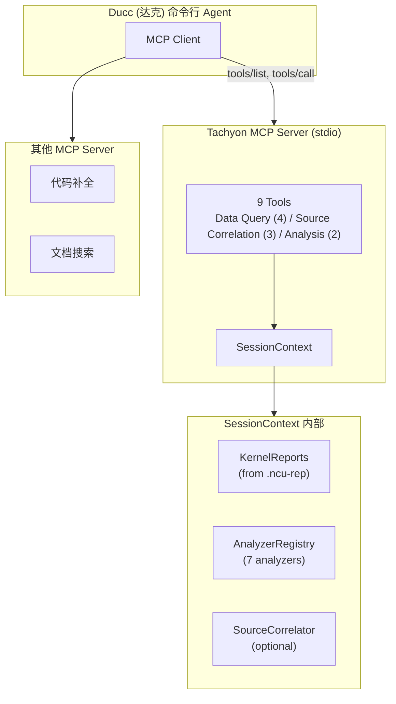

# 多 LLM 后端切换与 Ducc 工具集成

Tachyon 支持多种 LLM 后端，同时可作为 MCP Tool 接入 Ducc（达克）命令行工具。本文档覆盖后端切换方法、集成方式和自定义扩展。

## 1. 多 LLM 后端切换

支持三种后端：

| Backend | 覆盖范围 | SDK |
|---------|---------|-----|
| `openai` | OpenAI / Azure / vLLM / Ollama 等 OpenAI 兼容端点 | `openai` |
| `anthropic` | Anthropic Claude 系列 | `anthropic` |
| `litellm` | 100+ providers 统一路由（Google、Cohere、千帆、智谱等） | `litellm` |

### 1.1 配置文件切换

编辑 `~/.tachyon/config.toml`，选择一种填入即可：

```toml
# OpenAI（默认）
[llm]
provider = "openai"
model = "gpt-4o"
api_key_env = "OPENAI_API_KEY"

# Anthropic Claude
[llm]
provider = "anthropic"
model = "claude-sonnet-4-20250514"
api_key_env = "ANTHROPIC_API_KEY"

# Google Gemini（走 LiteLLM）
[llm]
provider = "litellm"
model = "gemini/gemini-2.0-flash"
api_key_env = "GEMINI_API_KEY"

# 百度文心一言（走 LiteLLM）
[llm]
provider = "litellm"
model = "qianfan/ERNIE-Bot-4"
api_key_env = "QIANFAN_AK"

# 本地 vLLM / Ollama（OpenAI 兼容）
[llm]
provider = "openai"
model = "qwen2.5-72b"
api_key_env = "OPENAI_API_KEY"  # 本地部署可设为任意值
base_url = "http://localhost:8000/v1"
```

### 1.2 环境变量切换

不想改配置文件时，直接用环境变量：

```bash
# OpenAI
export OPENAI_API_KEY=sk-...
export TACHYON_LLM_PROVIDER=openai
export TACHYON_MODEL=gpt-4o

# Anthropic
export ANTHROPIC_API_KEY=sk-ant-...
export TACHYON_LLM_PROVIDER=anthropic
export TACHYON_MODEL=claude-sonnet-4-20250514

# LiteLLM（任意 provider）
export GEMINI_API_KEY=...
export TACHYON_LLM_PROVIDER=litellm
export TACHYON_MODEL=gemini/gemini-2.0-flash
```

### 1.3 CLI 参数覆盖

临时用一次，不想改配置也不想设环境变量：

```bash
tachyon chat report.ncu-rep --provider anthropic --model claude-sonnet-4-20250514

tachyon chat report.ncu-rep --provider openai --model llama3.1 \
  # base_url 需在 config.toml 中配好
```

### 1.4 优先级

```
CLI 参数 > 环境变量 TACHYON_* > ~/.tachyon/config.toml > 内置默认值
```

### 1.5 SDK 调用

```python
from tachyon.llm.backend import create_backend
from tachyon.config.settings import TachyonConfig

# 直接指定
backend = create_backend(
    provider="anthropic",
    model="claude-sonnet-4-20250514",
    api_key="sk-ant-...",
)

# 从配置加载后修改
config = TachyonConfig.load()
config.llm.provider = "litellm"
config.llm.model = "gemini/gemini-2.0-flash"

# OpenAI 兼容端点（vLLM、Ollama、自建服务）
backend = create_backend(
    provider="openai",
    model="qwen2.5-72b",
    api_key="dummy",
    base_url="http://gpu-server:8000/v1",
)
```

### 1.6 自动降级

LLM 连接失败时，Tachyon 自动 fallback 到 Rule-Only 模式：

- **AI Agent 模式**（LLM 可用）: 9 Tools + LLM 推理，支持多轮对话
- **Rule-Only 模式**（LLM 不可用或 `--no-ai`）: 7 Analyzers 直出结构化报告，零 token 消耗

Rule-Only 模式输出包括：roofline / memory / occupancy 等分析 Finding、Optimization Tree、Markdown 报告。

```bash
tachyon analyze report.ncu-rep --no-ai   # 强制 Rule-Only
```

### 1.7 Token 消耗参考

| 场景 | 大致消耗 |
|------|---------|
| 单轮对话（分析一个 kernel） | 2K-4K |
| 多轮对话（深入分析 + 源码关联） | 8K-15K |
| 批量分析（10 kernels） | 20K-40K |
| Rule-Only 模式 | 0 |

---

## 2. Ducc（达克）集成

Tachyon 通过 MCP 协议对外暴露 9 个分析工具，Ducc 作为 MCP Client 可直接调用。

### 2.1 MCP Server 模式（推荐）

在项目根目录创建 `.claude/settings.json`：

```json
{
  "mcpServers": {
    "tachyon": {
      "command": "tachyon",
      "args": ["serve", "--mcp", "--report", "./report.ncu-rep"]
    }
  }
}
```

启动 Ducc 后，Tachyon 自动注册为 MCP Tool。对话示例：

```
"分析一下 report.ncu-rep 中最慢的 kernel"
"matmul kernel 的 memory coalescing 效率怎么样？"
"给我看 stencil kernel 的 SASS 热点代码"
```

9 个可用 Tool：

| Tool | 功能 |
|------|------|
| `list_kernels` | 列出所有 kernel |
| `get_kernel_metrics` | 获取指定 kernel 的 metrics |
| `get_kernel_summary` | kernel 概要信息 |
| `get_ncu_rule_results` | NCU 内置规则的分析结果 |
| `get_source_hotspots` | 源码级热点 |
| `get_sass_for_line` | 指定源码行对应的 SASS 指令 |
| `get_stall_analysis` | warp 停顿原因分析 |
| `run_analysis` | 运行指定分析器 |
| `get_optimization_tree` | 获取优化建议树 |

### 2.2 CLI 管道模式

不用 MCP 时，Ducc 中直接执行 Tachyon 命令也可以：

```bash
tachyon analyze report.ncu-rep --format markdown
tachyon profile ./my_app --strategy radical
tachyon diff before.ncu-rep after.ncu-rep --threshold 3.0
```

### 2.3 SDK 嵌入模式

在 Ducc 的 Skill 或 Hook 中直接调 Tachyon Python API：

```python
from tachyon import NcuProfiler, ToolPathResolver, TachyonConfig
from tachyon.analyzers.base import AnalyzerRegistry
from tachyon.reader.ncu_reader import NcuReportReader

config = TachyonConfig.load()
reader = NcuReportReader()
kernels = reader.load("report.ncu-rep").data

registry = AnalyzerRegistry()
registry.auto_register()
for k in kernels:
    findings = registry.run_all(k)
    print(f"{k.demangled_name}: {len(findings)} findings")
```

### 2.4 集成架构



### 2.5 典型协作场景

- **CI/CD 性能审计**: Ducc pipeline 中调 Tachyon 分析新 kernel，自动卡性能门禁
- **交互式调优**: 开发者在 Ducc 中对话式地定位瓶颈、逐步优化
- **PR diff 检测**: 提交时自动对比 before/after profile，标记性能回退
- **多工具编排**: Ducc 同时调 Tachyon + 其他 MCP Server（代码补全、文档检索等）

---

## 3. 自定义 LLM Provider

### 3.1 OpenAI 兼容端点

最简单的方式。任何提供 `/v1/chat/completions` 接口的服务直接用：

```toml
[llm]
provider = "openai"
model = "your-model-name"
base_url = "https://your-api-endpoint.com/v1"
api_key_env = "YOUR_API_KEY"
```

适用于 vLLM、TGI、Ollama、FastChat、千帆 OpenAI 兼容模式等。

### 3.2 LiteLLM 路由

LiteLLM 通过模型名前缀自动路由：

```python
"gpt-4o"                                # OpenAI
"claude-sonnet-4-20250514"                       # Anthropic
"gemini/gemini-2.0-flash"               # Google
"command-r-plus"                        # Cohere
"together_ai/mistralai/Mixtral-8x7B"    # Together AI
"bedrock/anthropic.claude-3"            # AWS Bedrock
"azure/gpt-4o"                          # Azure OpenAI
"qianfan/ERNIE-Bot-4"                   # 百度千帆
"zhipu/glm-4"                           # 智谱
```

### 3.3 自定义 Backend

继承 `LLMBackend` 抽象类，实现三个方法：

```python
from tachyon.llm.backend import LLMBackend, CompletionResponse, Message, ToolCall

class MyBackend(LLMBackend):
    async def chat_completion(self, messages, tools=None, **kwargs):
        # 调你的 API
        ...

    def format_tool_definitions(self, tools):
        # ToolDefinition -> 你的 API 格式
        return [t.to_openai() for t in tools]

    def parse_tool_calls(self, response):
        # 从响应中提取 ToolCall
        ...
```

实现后在 `create_backend()` 中注册 provider 名即可。

---

## 4. 常见问题

| 现象 | 排查 |
|------|------|
| `LLM backend not available` | API key 环境变量是否已设置 |
| `Unknown LLM provider: xxx` | provider 值只能是 openai / anthropic / litellm |
| `ImportError: openai` | `pip install openai` |
| `ImportError: anthropic` | `pip install anthropic` |
| `ImportError: litellm` | `pip install litellm` |
| 自动降级到 Rule-Only | 正常行为，LLM 不可用时自动 fallback |
| MCP server 连接失败 | `pip install tachyon-cuda[mcp]` |
| Ducc 找不到 tachyon 命令 | 确认 `tachyon` 在 `$PATH` 中，或 settings.json 中用绝对路径 |
